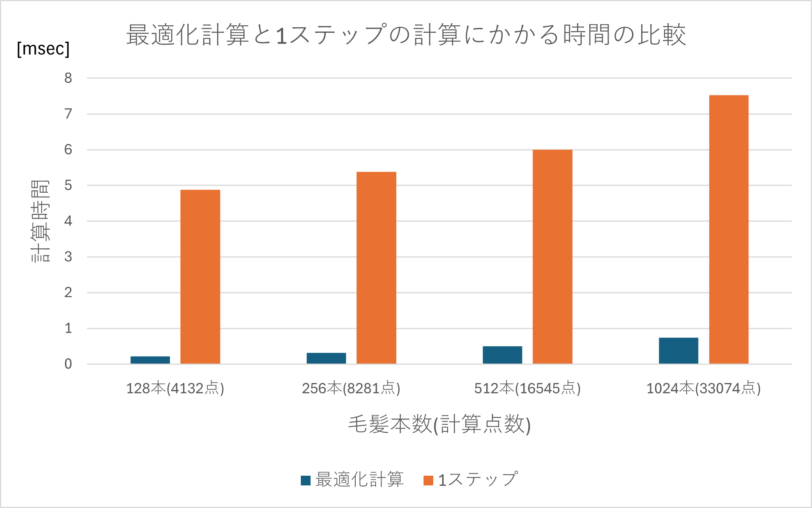

# 毛髪の重力によるたるみを防ぐ先行研究の高速化
卒業研究で取り組んだプログラムです。高速化の対象とする先行研究は以下となります．  
[先行研究1 "Sag-Free Initialization for Strand-Based Hybrid Hair Simulation"](https://dl.acm.org/doi/10.1145/3592143)  
[youtube上の動画](https://www.youtube.com/watch?v=jF3CgUt3ekk)
## 目標
先行研究をベースとした、シミュレーション開始時に毛髪の重力による変形を防ぐ物理シミュレーションのプログラムを開発した上で、これを高速化し、リアルタイムアプリケーションへの応用を目指す。

## 実行環境について
現在、SPH法や髪型の挙動を求めるために、CUDAを用いたプログラムを取り入れています。そのため、CUDAのインストールとVisualStudioが必要です。CUDA11.8,VisualStudio2022で実行確認をしました。CUDAのバージョンは11.4~11.8なら実行可能だと考えていますが，確認はしていません。ビルドのカスタマイズ->ビルドの依存関係からCUDAのバージョンの設定が可能です。また、Release,x64でのみの動作確認となる。(Debugで実行をするとエラーが発生します．)VisualStudioで開発をしていますが、ソリューションファイルはSPH_SagFree.slnです。(後から変更しているため、わかりにくくてすみません。)

## 作品提出におけるobjファイルの不足について
今回，髪型のobjファイルを利用していますが，これは一部のファイルは私の所属する研究室がある企業様から研究目的での利用を前提に頂いたものになります(プログラム内では，BobHairと記載．)．そのため，今回このファイルを含めて提出することができません．他の髪型ファイルは[先行研究4 Structure-Aware Hair Capture](https://gfx.cs.princeton.edu/pubs/Luo_2013_SHC/structure-hair.pdf)
(Linjie Luo, Hao Li and Szymon Rusinkiewicz
ACM Transactions on Graphics (Proc. SIGGRAPH), 32(4), 2013 [プロジェクトページ](http://gfx.cs.princeton.edu/proj/trimesh2/))
の髪型データを実験環境用に編集したものになります．

## 研究の概説
objファイルから読み込んだ髪型に対し、先行研究での手法を並列計算のために，非常に簡略化した4段階の最適化計算の実装を行いました。(LocalTorqueStepについてアドバイスをしていただいた著者の一人のHsuさんに感謝します。)初期化計算や毛髪の弾性変形にはCUDAを利用したGPGPUによる並列計算を行うことで大幅な高速化を達成しました．計算時間は以下のようになります．
  
一方で，この手法を利用した髪型は剛性が高くなり，外力に対する変形が非常に硬くなる問題点も発生しました．  
毛髪同士の相互作用にはSPH(Smoothed Particle Hydrodynamics)法を，毛髪のレンダリングにはKajiya-Kayモデルを，シミュレーション手法としては拡張位置ベース法を利用しています．

## GUIでの操作について
GUI上ではそれぞれの髪型が最適化計算を行うことで，重力や外力に対して，どの様に変形するかを比較することができます．SagFreeと書かれている方が研究での最適化計算を行った場合に相当します．現在は，比較のために，一定ステップで横向きの外力がかかり，一定ステップでシミュレーション全体がストップするようになっています．  
SetWindPowerでは，風をイメージした横向きの外力の強さを設定でき，ApplyWindを設定することで，実際に外力をかけられます．

## 補足
GitHubにアップロードするために，不要だと思われる一部ライブラリファイルを追跡対象外としており，何かしら不具合が発生するかもしれません．一部実験の様子はVideos/AllHairStyle.mp4にあります．実際に実行する必要があり，不具合で実行ができない場合にはご連絡いただけると幸いです．

## 実装について

### はじめに
これは大学の授業のPBD(位置ベース法)の学習のためのプログラムをベースに開発を行ったものにSPH法(Smoothed Particle Hydrodynamics)のGPUでの計算のプログラムを組み合わせたものです。そのため，SPH法の計算やImGUIの設定，GPUへのデータ転送やメモリ確保，OpenGLでのレンダリングなどの基本となる設定は既に実装していたもの(実験環境用に一部変更したものも多いですが)を利用しています．これを元に毛髪用に様々な処理を実装しました．初期化計算や制約の処理については全て自作したものであり、他の部分については既存の研究室プロジェクトを参考にしているものも多いですが、基本的に自分で書いたものです．
シミュレーションの手法はXPBD(拡張位置ベース法)です。毛髪はコセラロッドとして、質点とエッジの集合として表現します。利用するパラメータなどについては、  
[先行研究3 "Position and Orientation Based Cosserat Rods"](https://diglib.eg.org/items/eb5dd4ac-529c-4d6b-86ab-454cec714272)  
[先行研究4 "XPBD: Position-Based Simulation of Compliant Constrained Dynamics"](https://matthias-research.github.io/pages/publications/XPBD.pdf)などを参照してください。  
CPUからGPUにデータ転送をした後の処理については基本的にGPUを利用し，毛髪の挙動に関する計算にはCUDAを，レンダリングに関する計算にはGLSLを利用しています．
以下では、実装の一部分について寛太に説明します．

### GlobalForceStep
GlobalForceStepでは、エッジごとにかかる重力に基づく力を考えます。ここでは，考慮する力を重力とエッジにかかる力のみとすることで，GPUで並列計算が可能な形としました．一方で，このステップを大幅に簡略化したことが問題点にも直結していると考えています．

### LocalForceStep
LocalForceStepでは、GlobalTorqueStepで求めた力から、毛髪の基準長や姿勢を変化させ．重力に釣り合うように設定します．y軸平行な直線の場合、この処理のみで毛髪の変形を防げますが、そうでない場合にはエッジを短くしたり，姿勢を変更したりすることで，トルクが発生し，x,z方向にも力が加わるため、エッジの間の角度(基準ダルボーベクトル)を変更する必要があります。
### GlobalTorqueStep
ここではForceStepによって生まれたトルクを打ち消すことで変形を防ぎます。そのために、基準となるダルボーベクトルを変更します。ここでは，隣接するエッジによって，間のダルボーベクトルが計算されるため，GPUによって，毛髪ごとに逐次的に解く方法を実装しています。ただ，この状態では，基準ダルボーベクトルとならないので，適切な形で正規化をする必要があります．
### LocalTorqueStep
ここでは、個々の基準ダルボーベクトルに対して、変形を防ぐようなダルボーベクトルを曲げ剛性を含めて、適切に設定します。変形を防ぐ成分を維持した上で，ダルボーベクトルを正規化します．ここでは，複数の条件を満たすために，曲げ剛性を高めることで，適切な基準ダルボーベクトルとします．ここで，ユーザー定義のパラメータを用いることで，GlobalForceStepを簡略化したことで発生する変形を一定程度低減させることができます．しかし，これにより曲げ剛性が高くなることも確認されています．

## SPH法について
SPH法は毛髪同士の衝突を扱うために、利用をしています。(先行研究1では同様の理由でMPM法を利用)SPH法の計算はGPUで行われます。毛髪を上から球に接触させた場合に毛髪同士が接触することで、横に押し出されたり、ボリュームを表現したりすることができます。

現在は，毛髪の最初のエッジを固定する処理としたため，上の動画と動きがかなり異なります．また，現在パラメータの調整がうまくいっておらず，髪型に対するパラメータとこの実験で，一部のパラメータを変更する必要があります．

