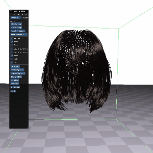
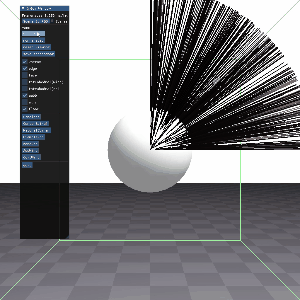

# 毛髪の重力によるたるみを防ぐ先行研究の高速化
卒業研究で取り組んでいるプログラムである。高速化の対象とする先行研究は以下のものである．  
[先行研究1 "Sag-Free Initialization for Strand-Based Hybrid Hair Simulation"](https://dl.acm.org/doi/10.1145/3592143)  
[youtube上の動画](https://www.youtube.com/watch?v=jF3CgUt3ekk)
## 目標
先行研究をベースとした、シミュレーション開始時に毛髪の重力による変形を防ぐ物理シミュレーションのプログラムを開発した上で、これを高速化し、リアルタイムアプリケーションへの応用を目指す。

## 実行環境について
現在、SPH法や髪型の挙動を求めるために、CUDAを用いたプログラムを取り入れている。そのため、CUDAのインストールとVisualStudioが必要となる。CUDA11.8,VisualStudio2022で実行確認をした。CUDAのバージョンは11.4~11.8なら実行可能だと考えている。ビルドのカスタマイズ->ビルドの依存関係からCUDAのバージョンの設定が可能である。また、Release,x64でのみの動作確認となる。

## 作品提出におけるobjファイルの不足について
今回，髪型のobjファイルを利用しているが，これは私の所属する研究室がある企業様から研究目的での利用を前提に頂いたものになります．そのため，今回このファイルを含めて提出することができません．大変恐縮ですが，必要であれば，bin/Assetsに適当な毛髪のobjファイルを置いていただき，scene.cppのinitMoreRodという関数でのreadObjFile関数の呼び出しの直前のfilenameに適切なファイル名を指定してください．ただ，パラメータによって，変形や自然な動きに影響を与えるので，髪型の形状によっては適切な動きにならない可能性があります．

## 現在の進捗(11/04)
初期化計算の設定を非常に簡略化し、objファイルから読み込んだ髪型に対し、先行研究1の4段階計算の実装を行った。(TorqueStepについてアドバイスをしていただいた著者の一人のHsuさんに感謝します。)トルクステップには課題も多く、論文におけるLocalTorqueStepとパラメータの大きさが明らかに異なる部分が存在し、制約計算のパラメータとの調整がうまくいっておらず、毛髪にさせたい動作や毛髪の状態により、多くのパラメータの調整が必要となり、一番改善が必要な点である。SPH法において，一部に不安定性があるように見えるが，圧力項の計算ではなく，密度制約で反復を一定回数行えば解消できるように見えるが確認中である．
複数の毛髪を扱うことを想定し、衝突を行えるSPH法のプロジェクトに既存のプログラムを移植した。初期化計算やレンダリング，毛髪の動きに関する計算は全てシェーダやGPGPUで行うようにしており，objファイルからの読み込みなど初期化計算以前の処理以外はほとんどGPUで行っている．現在は，静止摩擦力を実装し，初期化計算に含めて考慮することで，動きの自然さと形状の維持の両立を目指しているが，現在，実装の途中であるため，提出するプログラムからは除いている．

## プログラムの概説
以下ではいくつかの動画を示し、プログラムを説明する。動画には、以前録画したものも含まれ、現在とは異なるコードで実行したものが含まれるが、処理や描画はおおむね同じである。また、VisualStudioで開発をしているが、ソリューションファイルはSPH_SagFree.slnである。(後から変更しているため、わかりにくくてすみません。)

### はじめに
これは大学の授業のPBD(位置ベース法)の学習のためのプログラムをベースに開発を行ったものにSPH法(Smoothed Particle Hydrodynamics)のGPUでの計算のプログラムを組み合わせたものである。初期化計算や制約の処理については全て自作したものであり、他の部分については既存の研究室プロジェクトを参考にしているものも多いが、基本的に自分で書いたものである．SPH法の計算は大幅には変更していないが，元のプロジェクトが毛髪向きのものではないため，手を加えている．
シミュレーションの手法はXPBD(拡張位置ベース法)である。毛髪はコセラロッドとして、質点とエッジの集合として表現する。利用するパラメータなどについては、  
[先行研究2 "Position and Orientation Based Cosserat Rods"](https://diglib.eg.org/items/eb5dd4ac-529c-4d6b-86ab-454cec714272)  
[先行研究3 "XPBD: Position-Based Simulation of Compliant Constrained Dynamics"](https://matthias-research.github.io/pages/publications/XPBD.pdf)などを参照されたい。  
GPU上でSPH法の計算やレンダリング，毛髪の動きに関する計算を実装している。メモリの変数や確保が膨大になっているため、制作したデータ転送の手法の改善やメモリの確保の工夫なども行いたい。
以下では、現時点での4段階計算を中心に、他の処理については簡単に説明する。

### GlobalForceStep
GlobalForceStepでは、エッジごとにかかる重力に基づく力を考える。現在は重力しか考慮していないため、質点の数により、エッジにかかる力は容易に求められるが、GPUにおいて，毛髪ごとに並列計算をし，連結しているエッジから受ける力を考え，これを解いている。現在は，静止摩擦などを考え、より現実的かつ安定したシミュレーションを目指している．
### LocalForceStep
LocalForceStepでは、GlobalTorqueStepで求めた力から、毛髪をどれほど短くすれば、これに一致する力を導出できるかを求める。このようにすることで、毛髪に外力を加える必要がないため、自然なシミュレーションを保ったまま、重力による変形を防ぐことができる。それぞれのエッジにかかる力をすでに求めているので，この計算は毛髪単位より細かい，エッジ単位での実装が可能である．また、この状態であると，かけられる力が，毛髪の方向に限られるため，毛髪の姿勢を変更する。  

y軸平行な直線な場合、この処理のみで毛髪の変形を防げるが、そうでない場合には、エッジを短くしたり，姿勢を変更したりすることで，トルクが発生し，x,z方向にも力が加わるため、エッジの間の角度(基準ダルボーベクトル)を変更する必要がある。
### GlobalTorqueStep
LocalForceStepまででは、螺旋型のような場合、変形を防ぐことができない。ここでは、ForceStepによって生まれたトルクを打ち消すことで変形を防ぐ。そのために、基準となるダルボーベクトルを変更する。GPUによって，毛髪ごとに逐次的に解く方法を実装している。ただ，この状態では，基準ダルボーベクトルとならないので，適切な形で正規化をする必要がある．
### LocalTorqueStep
ここでは、個々のエッジに対して、変形を防ぐようなダルボーベクトルを曲げ剛性を含めて、適切に設定する。具体的には変形を防ぐ成分を維持した正規化や曲げ剛性を局所的に高めるなどである。ここでは，曲げ剛性と正規化した結果を求める際に，定数パラメータの設定が必要であるが，この設定によって，重力による変形を防ぐことができなかったり，自然な動きができなくなったりしてしまう．制約に用いるパラメータも含めて，この設定を適切に行うことが必要である．  
  
  以下の動画は途中で右方向に力を与え，途中で力を止めている．初期化計算の有無とLocalTorqueStepの定数パラメータ以外の設定は全て同じにしている．変更している定数パラメータはsph_kernel.cuのsolveInverseRotのSAFETY_FACTORの第二引数である．  
  変形を防ぐための初期化計算をしない場合

.gif)

LocalTorqueStepの定数パラメータを0.002で設定

.gif)

LocalTorqueStepの定数パラメータを0.00002で設定

.gif)

このように自然な動きと重力による変形を防ぐことが完全にトレードオフの関係になってしまっており，個々の改善が必要である．現在は静止摩擦力を定義できるようにし，摩擦力を含めて考えることで，改善をしていきたいと考えている．
コンピュータで計算している以上、誤差が発生し、変形を完全に防ぐことは難しい。そのため、静止摩擦力を考慮したり、減衰を考慮したりすることで、ごく僅かな位置や姿勢の変化を切り捨てる処理が必要だと考えており、今後の課題である。

## 髪型の利用とレンダリング
objファイルから髪型を読み込み、毛髪の動きについてそれぞれを並列計算している。ここでは、GPUを利用することで、粒子数約20個の毛髪約3500本に対して十分にリアルタイムで計算が可能になっている。(反復回数などにもよる)また、レンダリングについては、CUDAとGLSLでメモリを共有する仕組みを利用し、CPUにデータを戻すことなく、計算が可能になっている。

## SPH法について
SPH法は毛髪同士の衝突を扱うために、利用をしている。(先行研究では同様の理由でMPM法を利用)SPH法の計算はGPUで行われている。毛髪を上から球に接触させた場合に毛髪同士が接触することで、横に押し出されたり、ボリュームを表現したりすることができる。
初期化時にSPHによる変形を防ぐ場合に、不安定になる場合があり，密度制約において，一定回数反復を行う形にすることで，このような不安定性を防げているように見える．

## 今後の予定
先述したように、LocalTorqueStepの理解が十分でなく、適切な実装ができていない。先行研究1では、[先行研究4 "GPU optimization of material point methods"](https://dl.acm.org/doi/10.1145/3272127.3275044)を参考にしたMPM法が利用されていたが、既に利用可能なコードがあることと、並列計算による高速化を目指すため、現在は既に実装されたコードのあるSPH法での実装を目指す。XPBDでの処理においても毛髪のリアルな挙動や重力による変形を防ぐ際に、毛髪の状態、形状によってパラメータの変更が必要になる。これらの課題は主に適切なパラメータ設定ができていないことが原因であると考えている。今後はこれが最大の課題だと考えている。これにより、より幅広い髪型にこの手法を適用できるようにしたい。  
また、リアルな表現や安定性，重力による変形を防ぐために、SPH法での静止摩擦を考慮したい。

## 追加
CUDAの設定などが邪魔な場合には、[SagFree(0729)](https://drive.google.com/file/d/179vAO3zN-ElpYKOv6M4ADTrcHQfQ0Mx8/view?usp=sharing)をドライブに置いています。こちらではCUDAの利用はありません。ただし、SPH法側の処理がない他にも、SagFreeの処理も古いものが多く、全体に処理がかなり変化しています。
